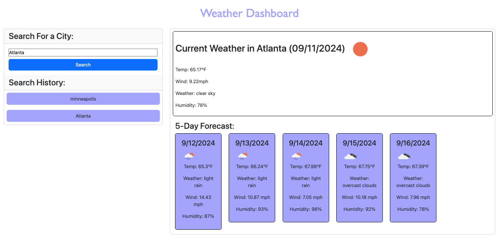

# weather-dashboard

## Description
This Weather Dashboard application allows users to view the current weather and 5-day forecast for multiple cities. The app uses the OpenWeather API to fetch weather data and dynamically update the user interface with HTML, CSS, and JavaScript.
 This project was designed for U of MN bootcamp through EdX

## Usage
1. Enter the name of a city in the search input.
2. View the current weather and 5-day forecast for the city.
3. Click on cities in the search history to view their weather details again.

## Key Features:
Search for cities: Users can input a city name to see the current weather and the 5-day forecast.
Search history: The searched cities are saved and clickable to view weather details again.
Weather details: Displays the temperature, humidity, wind speed, and an icon for the weather condition.
5-day forecast: Shows upcoming weather information including temperature, humidity, and wind speed.

### Deployed site:
https://andreacannon.github.io/weather-dashboard/

